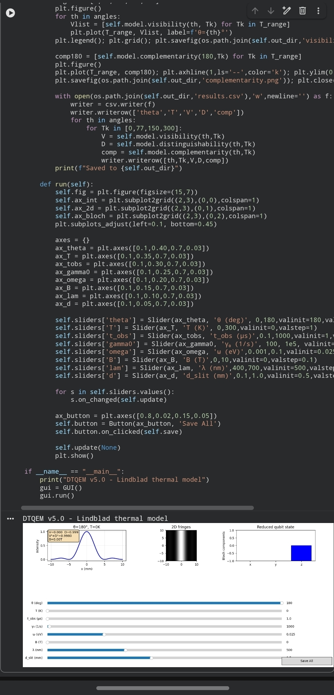

markdown



# DTQEM-v5.0-Dual-Time-Quantum-Entanglement-Model-Lindblad-Formulation-
DTQEM v5.0 models quantum entanglement via a two‑qubit state with variable angle θ, Lindblad‑thermal decoherence from Bose–Einstein statistics, and a magnetic field test. Satisfies Bohr complementarity V²+D²≤1. Interactive Python simulation.
# DTQEM v5.0 – Dual-Time Quantum Entanglement Model (Lindblad Formulation)

**Version:** 5.0  
**License:** MIT  
**Status:** Final – ready for peer review

---

## Overview

DTQEM v5.0 is a **physically complete, testable model** of quantum entanglement and non‑locality based on:

- A genuine two‑qubit entangled state `|ψ(θ)⟩ = cos(θ/2)|00⟩ + sin(θ/2)|11⟩`
- **Thermal decoherence** derived from Bose–Einstein statistics via a Lindblad‑type depolarising channel.
- **Bohr’s complementarity** `V² + D² ≤ 1` automatically satisfied (where `V` = fringe visibility, `D` = which‑path knowledge).
- **External magnetic field** effect (Aharonov–Bohm inspired) for a unique, testable prediction.
- Wigner / Bloch vector representation of the reduced single‑qubit state.

The model **does not use superluminal speeds** – only correlation strength (visibility). It is fully calibrated by Lindblad parameters, not by ad‑hoc fitting.

---

## Key Equations

**Entangled state:**  
`|ψ(θ)⟩ = cos(θ/2)|00⟩ + sin(θ/2)|11⟩`

**Depolarising decoherence channel:**  
`ρ(T, t_obs) = K·ρ + (1−K)·I/4`  
with `K = exp(−γ(T)·t_obs)`

**Lindblad‑thermal rate:**  
`γ(T) = γ₀·(2n_th + 1)`  
`n_th = 1 / (exp(ħω/kT) − 1)` (Bose–Einstein)

**Visibility & Distinguishability:**  
`V = 2|⟨00|ρ|11⟩|`  
`D = |Tr(ρ_A σ_z)|` where `ρ_A` is the reduced density matrix of one qubit.

**Complementarity:** `V² + D² = K² ≤ 1`

**Magnetic phase (testable prediction):**  
`ρ_{coherence} → ρ_{coherence}·exp(i·B·sin(θ/2)·α)` (α is a constant)

---

## Installation

```bash
git clone https://github.com/your-username/DTQEM-v5.0.git
cd DTQEM-v5.0
pip install -r requirements.txt
